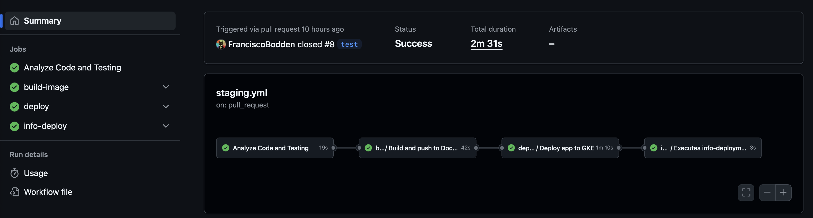

## DevOps Prueba 

Este repositorio tiene la siguiente estructura para la prueba tecnica de DevOps:

devsu-test-ci-cd/
├── .github/
│   └── workflows/
│       ├── dev.yml            
│       ├── staging.yml
│       ├── release.yml
│       ├── ci-build.yml
│       ├── cd-clen.yml
│       ├── cd-deploy.yml
│       ├── cd-infodeploy.yml
├── app/
│   ├── codecov.yml
│   ├── coverage/
│   │   └── ... (archivos de cobertura )
│   ├── dev.sqlite
│   ├── Dockerfile
│   ├── helmapp/
│   │   └── ... (archivos Helm)
│   ├── node_modules/
│   │   └── ... (módulos de Node.js instalados)
│   ├── package-lock.json
│   ├── package.json
│   ├── README.md
│   └── src/
│       ├── index.js
│       ├── app.js
│       └── ...(otros archivos fuente del proyecto)
└── iac-gke/
    ├── main.tf
    ├── variables.tf
    └── outputs.tf

## Requisitos:

Git: Sistema de control de versiones para gestionar cambios en el código.
Terraform: Para gestionar la infraestructura como codigo.


## IAC:

La creacion del Cluster de GKE se hizo con terraform

## Configuracion

** Clonar el repositorio**

   ```bash
   git clone https://github.com/FranciscoBodden/devsu-test-ci-cd.git
   cd devsu-test-ci-cd
   ```

** Descargar archivo de conecion con solo permiso necesario **

- Ve a la Google Cloud Console.
- Accede al proyecto de GCP donde está tu clúster GKE.
- Navega a "IAM & Admin" > "Service Accounts".
- Crea una nueva cuenta de servicio con permisos adecuados para gestionar tu GKE (normalmente, el rol "Kubernetes Engine Admin" es suficiente).
- Descarga el archivo JSON de la cuenta de servicio.

** Desplegar Cluster de GKE con terraform **

Modificar el archivo devsu-test-ci-cd/aic-gke/main.tf en la linea 5 esto:   credentials = file("/tu/path/archivo.json")  con la ruta de tu archivo conexion.

    ```bash
    cd iac-gke
    terraform init
    terraform plan
    terraform apply
    ```

## CI/CD

Se utlizo Github Actions como herramienta de CI/CD, se uso workflows reusable para ser reutilziados en los diferetnes ambientes y para poder ser mantenido de forma eficiente.

## Pipeline 

El pipeline corre los siguientes pasos test, build-image, deploy, info-deploy usando workflow reusables.

- Compilación del código fuente.
- Ejecución de pruebas unitarias.
- Creación de artefactos (como archivos binarios, contenedores Docker, etc.).
- Despliegue en GKE entorno de pruebas o producción.
- Notificación de informacion del Deployment en los comentario del Pull Request

[](adjuntos/imagenes/pipeline.png)