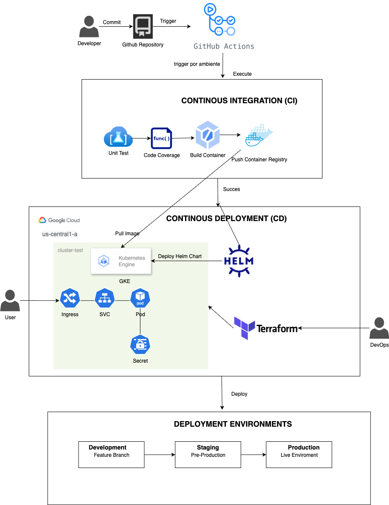
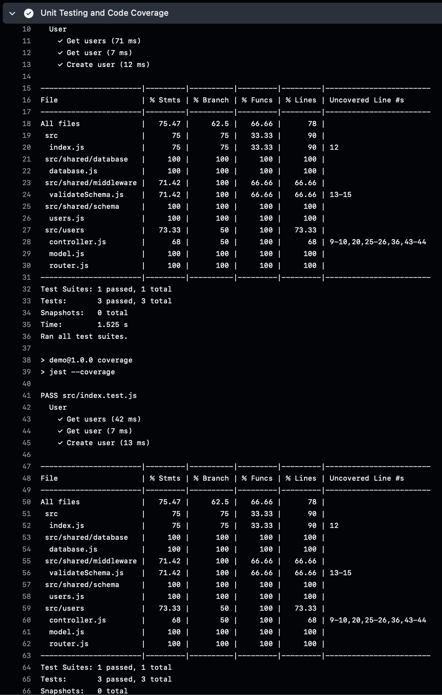
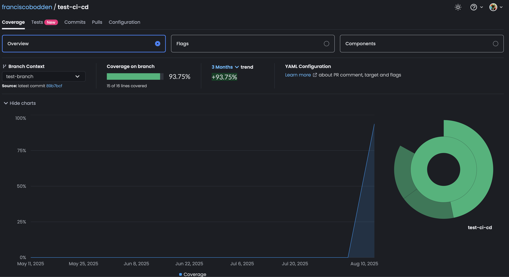
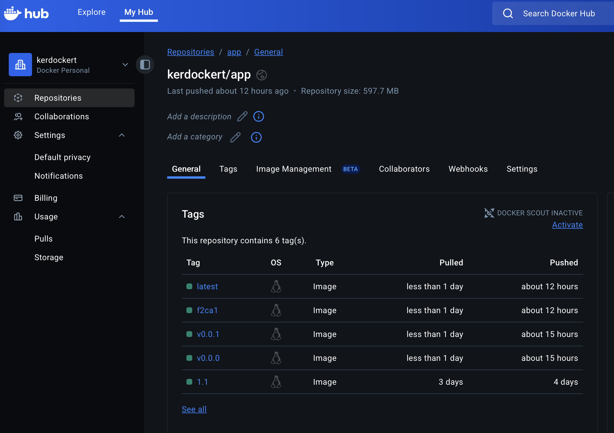
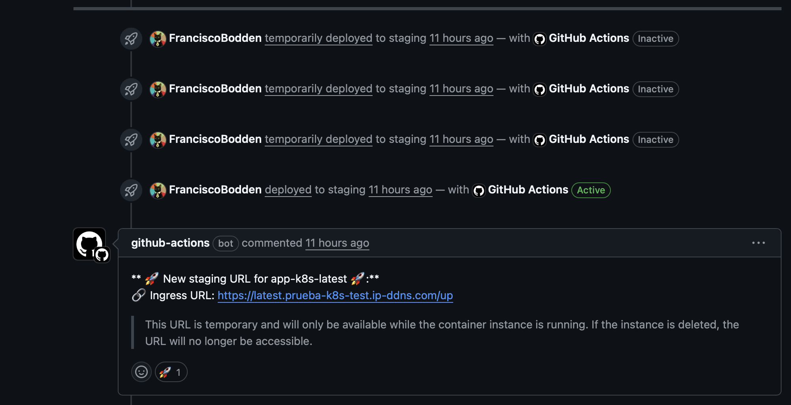
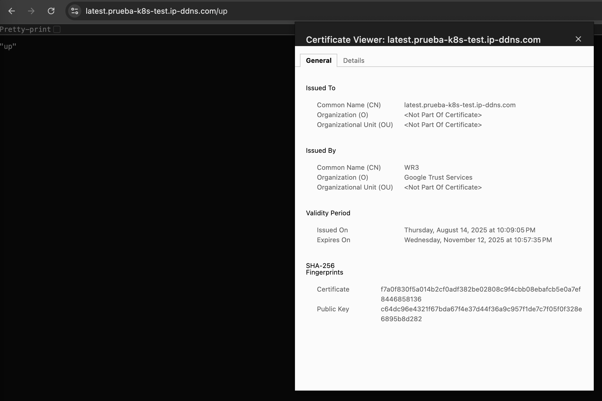
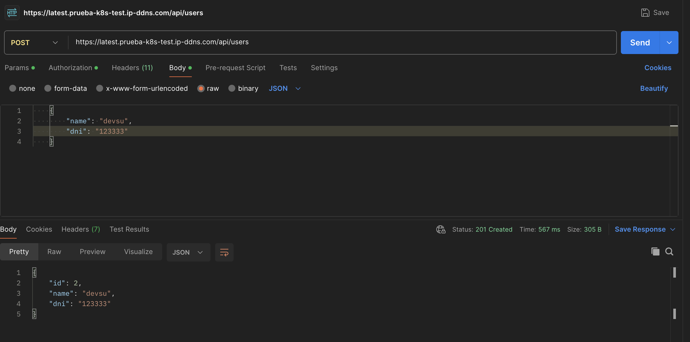
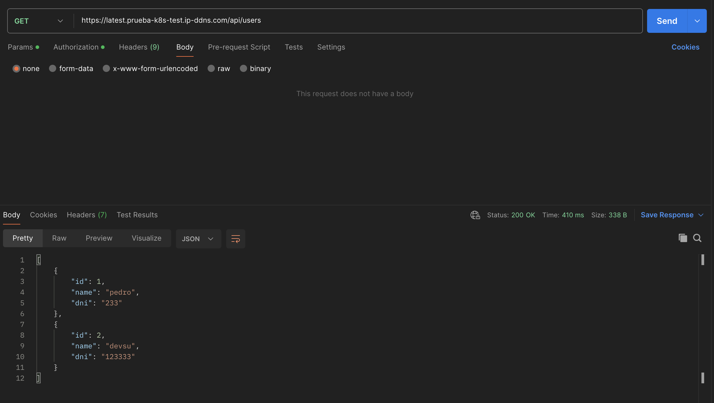

## DevOps Prueba 

[](adjuntos/imagenes/DevOps.png)

Este repositorio tiene la siguiente estructura para la prueba tecnica de DevOps:

```bash
.
├── .github/
│   └── workflows/
│       ├── dev.yml
│       ├── staging.yml
│       ├── release.yml
│       ├── ci-build.yml
│       ├── cd-clen.yml
│       ├── cd-deploy.yml
│       ├── cd-infodeploy.yml
├── app/
│   ├── codecov.yml
│   ├── coverage/
│   │   └── ... (archivos de cobertura)
│   ├── dev.sqlite
│   ├── Dockerfile
│   ├── helmapp/
│   │   └── ... (archivos Helm)
│   ├── node_modules/
│   │   └── ... (módulos de Node.js instalados)
│   ├── package-lock.json
│   ├── package.json
│   ├── README.md
│   └── src/
│       ├── index.js
│       ├── app.js
│       └── ...(otros archivos fuente del proyecto)
└── iac-gke/
    ├── main.tf
    ├── variables.tf
    └── outputs.tf
```

## Requisitos:

Git: Sistema de control de versiones para gestionar cambios en el código.
Terraform: Para gestionar la infraestructura como codigo.

## IAC:

La creacion del Cluster de GKE se hizo con terraform

## Configuracion

1. **Clonar el repositori**:

   ```bash
   git clone https://github.com/FranciscoBodden/devsu-test-ci-cd.git
   cd devsu-test-ci-cd
   ```
2. **Descargar archivo de conecion con solo permiso necesario**:

- Ve a la Google Cloud Console.
- Accede al proyecto de GCP donde está tu clúster GKE.
- Navega a "IAM & Admin" > "Service Accounts".
- Crea una nueva cuenta de servicio con permisos adecuados para gestionar tu GKE (normalmente, el rol "Kubernetes Engine Admin" es suficiente).
- Descarga el archivo JSON de la cuenta de servicio.

3. **Desplegar Cluster de GKE con terraform**:
    Modificar el archivo devsu-test-ci-cd/aic-gke/main.tf en la linea 5 esto:   credentials = file("/tu/path/archivo.json")  con la ruta de tu archivo conexion.

    ```bash
    cd iac-gke
    terraform init
    terraform plan
    terraform apply
    ```
## CI/CD

Se utlizo Github Actions como herramienta de CI/CD, se uso workflows reusable para ser reutilziados en los diferetnes ambientes y para poder ser mantenido de forma eficiente.

## Pipeline 

El pipeline corre los siguientes pasos test, build-image, deploy, info-deploy usando workflow reusables.

- Ejecución de pruebas unitarias.
- Creación de artefactos (como archivos binarios, contenedores Docker, etc.).
- Despliegue en GKE entorno de pruebas o producción.
- Notificación de informacion del Deployment en los comentario del Pull Request

[](adjuntos/imagenes/pipeline.png)

1. Unit testing code y Coverage: Ejecucion de los test y el coverage.

[](adjuntos/imagenes/unittest-coverage.png) 

2. Subir coverage reporte a Codecov: Se sube el reporte hacia Codecov

[](adjuntos/imagenes/codecov.png)

3. Build, tag and Push a DockerHub:  Se hace el build con el Dockerfile, se tagea la imagen y se hace push hacia DockerHub.

[](adjuntos/imagenes/dockerhub.png)

4. Scan image con Trivy: Se escanea la imnagen con Trivy.

5. Deploy aplicacion a GKE: Se despliega el helmchart hacia GKE

6. Info deploy: Se comenta en el PR en el ambiente de staging y development.

[](adjuntos/imagenes/infodeploy.png)
## CODECOV 

Se uso Codecov como herramienta de gestion de cobertura de codigo, generar informe visual

## HELM

Se uso Helm como plantilla para el despligar en Kubernetes en GKE de acuerdo al ambiente ya sea desarollo, staging o producion.

## Certificado SSL

Para la gestion de los certificado SSL se uso ManagedCertificate para que se ejecute en el Ingress del Cluster de GKE

[](adjuntos/imagenes/certificado-ssl.png)

staging: https://latest.prueba-k8s-test.ip-ddns.com/up

producion: https://prod.prueba-k8s-test.ip-ddns.com/up


## Pruebas

Crear Usuario - POST

[](adjuntos/imagenes/prueba-post.png)

Obtener todos los Usuarios - GET

[](adjuntos/imagenes/prueba-get.png)

## Mejoras a Futuro:

1. Crear un volumen para esta base de datos para que sea permanente en caso de seguir con una base datos sqlite, si se usa base como MySQL crea un job para crear un base datos aislada para cada pull request creado tenga data con migracion y seeeder independiente para que se puede hacer prueba de QA asildas.

2. Usar gestor de Secret para los secret.

3. Implentar Sentry o cualquier herramienta de monitoreo de errores en la aplicacion.

4. Agregar un coletor de logs en el Cluster de Kubernetes.
